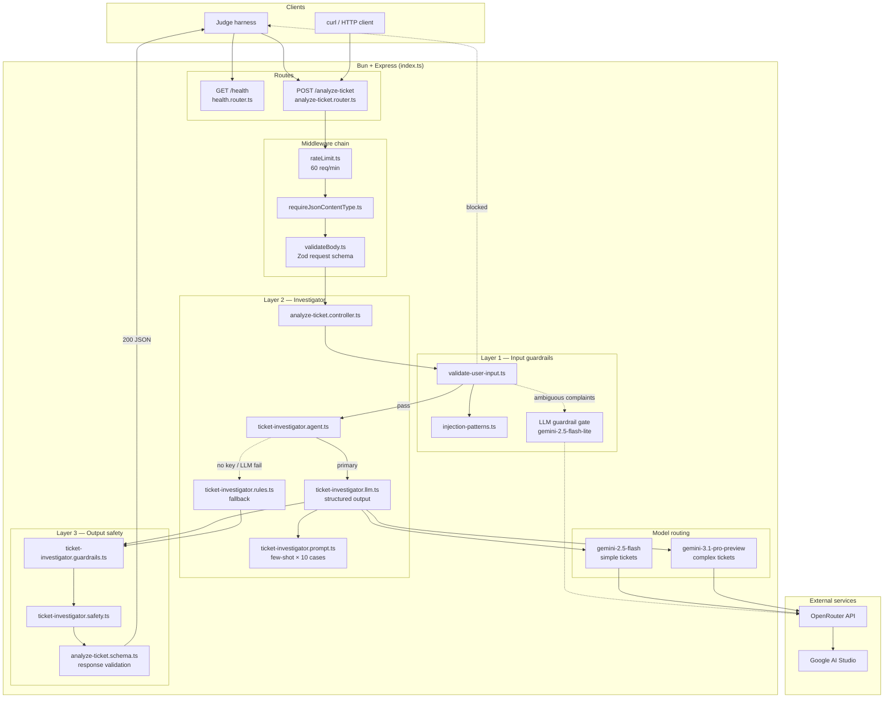
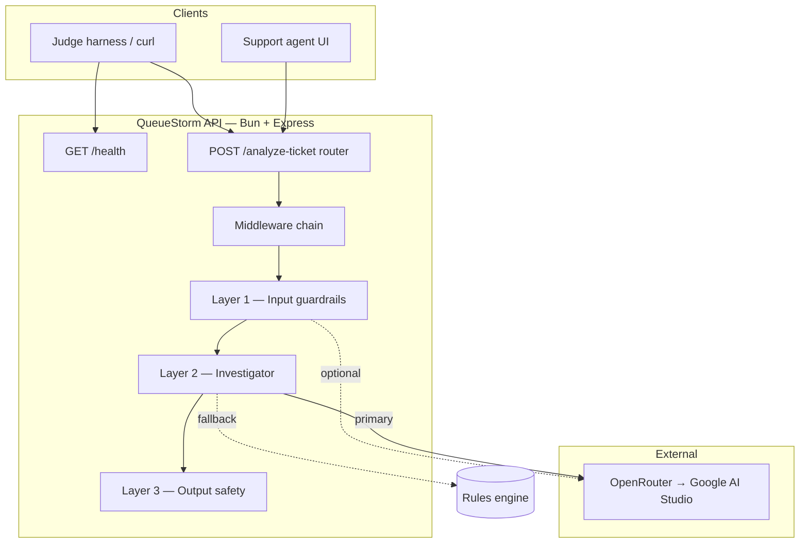
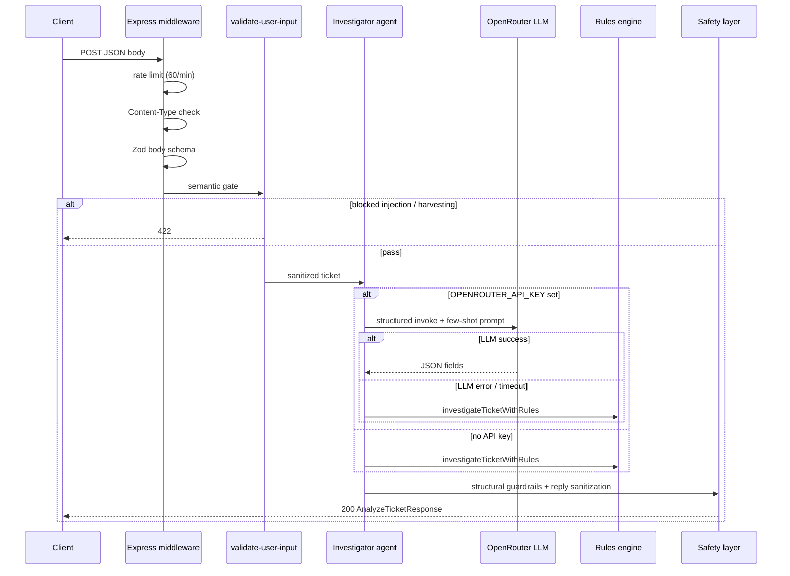

# QueueStorm Investigator

Support-ticket triage API for the **SUST CSE Carnival 2026 · Codex Community Hackathon** (Online Preliminary).

An AI/API support copilot for digital finance. The service receives a customer complaint plus recent transaction history, investigates what actually happened, classifies and routes the case, and drafts a safe reply for support agents. It is a **copilot for support agents**, not an autonomous financial decision maker.

**Judge-facing endpoints** (mounted at the service root — no `/api` prefix):

| Method | Path | Purpose |
| ------ | ---- | ------- |
| `GET` | `/health` | Readiness check — returns `{"status":"ok"}` within 60s of start |
| `POST` | `/analyze-ticket` | Analyze one ticket; returns structured investigation JSON within 30s |

---

## Quick start

### Prerequisites

- [Bun](https://bun.sh) ≥ 1.0
- `OPENROUTER_API_KEY` — required for LLM investigation; without it the service falls back to a deterministic rules engine (see [Architecture](#architecture))
- Optional: Docker + Docker Compose (for deployment)

### Install and run locally

```bash
git clone https://github.com/shu-vro/sust-hackathon-repo-2026.git
cd sust-hackathon-repo-2026
bun install
cp .env.example .env   # add your OPENROUTER_API_KEY
bun run start          # http://0.0.0.0:8000 (default PORT)
```

Bun loads `.env` automatically. See [Environment variables](#environment-variables).

```bash
bun run dev      # watch mode (hot reload)
bun run start    # production-style
```

Verify readiness:

```bash
curl http://localhost:8000/health
# {"status":"ok"}
```

Analyze a ticket (minimal example):

```bash
curl -s -X POST http://localhost:8000/analyze-ticket \
  -H "Content-Type: application/json" \
  -d @- <<'EOF'
{
  "ticket_id": "TKT-001",
  "complaint": "I sent 5000 taka to a wrong number around 2pm today.",
  "language": "en",
  "transaction_history": [
    {
      "transaction_id": "TXN-9101",
      "timestamp": "2026-04-14T14:08:22Z",
      "type": "transfer",
      "amount": 5000,
      "counterparty": "+8801719876543",
      "status": "completed"
    }
  ]
}
EOF
```

A worked sample request/response pair is in [`docs/sample-output.json`](docs/sample-output.json) (from public case `SAMPLE-01`).

### Docker

**Docker Compose** (recommended — uses `PORT` from `.env`, default `8000`):

```bash
cp .env.example .env
# Edit .env: set OPENROUTER_API_KEY (required for LLM path)

# Build and start in foreground
docker compose --env-file .env up --build

# Build and start detached
docker compose --env-file .env up --build -d

# Follow logs
docker compose logs -f api

# Stop and remove containers
docker compose down
```

Verify the container:

```bash
curl http://localhost:${PORT:-8000}/health
```

**Standalone `docker run`** (image sets `PORT=3001` unless overridden):

```bash
# Build
docker build -f Dockerfile.bun -t sust-hackathon:latest .

# Run on port 8000 (match local dev)
docker run --rm -d \
  --name queue-storm-api \
  --env-file .env \
  -e PORT=8000 \
  -p 8000:8000 \
  sust-hackathon:latest

# Or use the image default port 3001
docker run --rm -d \
  --name queue-storm-api \
  --env-file .env \
  -p 3001:3001 \
  sust-hackathon:latest

# Health check
curl http://localhost:8000/health   # or :3001 if using image default

# Stop
docker stop queue-storm-api
```

**Port note:** `docker-compose.yml` maps `${PORT:-8000}`. `Dockerfile.bun` bakes `PORT=3001` as a fallback when no env is passed. Set `PORT` explicitly in `.env` or `-e` to avoid surprises.

---

## API contract

| Method | Path | Description |
|--------|------|-------------|
| `GET` | `/health` | Returns `{"status":"ok"}` within 60s of start |
| `POST` | `/analyze-ticket` | Accepts one ticket; returns structured investigation JSON within 30s |

**Headers:** `Content-Type: application/json` (charset suffix allowed, e.g. `application/json; charset=utf-8`)

### HTTP status codes

| Code | When |
|------|------|
| `200` | Successful analysis |
| `400` | Malformed JSON or missing/invalid required fields (Zod validation) |
| `415` | Missing or non-JSON `Content-Type` |
| `422` | Valid schema but semantically blocked (e.g. prompt injection in complaint) |
| `429` | Rate limit exceeded (60 req/min per IP on `/analyze-ticket`) |
| `500` | Internal error (no stack traces or secrets in body) |

Request and response schemas match the [official problem statement](docs/problem-statement.md). Public sample cases: `src/routes/analyze-ticket/fixtures/SUST_Preli_Sample_Cases.json`.

---

## Tech stack

| Layer | Choice |
|-------|--------|
| Runtime | [Bun](https://bun.sh) |
| HTTP | Express 5 |
| Validation | Zod 4 |
| LLM orchestration | LangChain (`@langchain/openrouter`) |
| Security middleware | Helmet, CORS, express-rate-limit |
| Logging | Morgan |
| Container | Docker (`Dockerfile.bun`, `docker-compose.yml`) |

---

## Architecture

### Architecture graph

High-level component graph — request path, modules, and external dependencies:



ASCII equivalent (renders in any Markdown viewer):

```
┌─────────────────────────────────────────────────────────────────────────────┐
│                           CLIENTS (Judge / curl)                            │
└───────────────────────────────┬─────────────────────────────────────────────┘
                                │
              ┌─────────────────┴─────────────────┐
              ▼                                   ▼
       GET /health                      POST /analyze-ticket
       health.router.ts                analyze-ticket.router.ts
              │                                   │
              │                    ┌──────────────┼──────────────┐
              │                    ▼              ▼              ▼
              │              rateLimit    Content-Type    Zod body
              │              60/min        JSON only      schema
              │                    └──────────────┼──────────────┘
              │                                   ▼
              │                    ┌──────────────────────────────────┐
              │                    │  LAYER 1 — Input guardrails      │
              │                    │  validate-user-input.ts          │
              │                    │  injection-patterns.ts           │
              │                    │  optional LLM gate ──────┐       │
              │                    └────────────┬─────────────┼───────┘
              │                                 │             │
              │                          422 blocked         ▼
              │                                 │      OpenRouter (flash-lite)
              │                                 ▼
              │                    ┌──────────────────────────────────┐
              │                    │  LAYER 2 — Investigator          │
              │                    │  ticket-investigator.agent.ts    │
              │                    │    ├─► LLM (primary) ─────────┐  │
              │                    │    │    prompt + few-shot      │  │
              │                    │    │    flash / pro routing    │  │
              │                    │    └─► rules (fallback)       │  │
              │                    └────────────┬──────────────────┼──┘
              │                                 │                  ▼
              │                                 │           OpenRouter → Gemini
              │                                 ▼
              │                    ┌──────────────────────────────────┐
              │                    │  LAYER 3 — Output safety         │
              │                    │  guardrails → safety → Zod out   │
              │                    └────────────┬─────────────────────┘
              │                                 ▼
              └────────────────────────► 200 AnalyzeTicketResponse JSON
```

### System overview



### Request lifecycle (`POST /analyze-ticket`)



### Three-layer pipeline

| Layer | Module(s) | Responsibility |
|-------|-----------|----------------|
| **1 — Input** | `analyze-ticket.router.ts`, `validateBody.ts`, `validate-user-input.ts`, `injection-patterns.ts` | Rate limit, JSON content-type, Zod request schema, regex + optional LLM gate for prompt injection and credential-harvesting instructions |
| **2 — Investigator** | `ticket-investigator.agent.ts`, `ticket-investigator.llm.ts`, `ticket-investigator.rules.ts`, `ticket-investigator.prompt.ts` | Cross-check complaint vs `transaction_history`; pick `relevant_transaction_id`, `evidence_verdict`, routing enums; draft agent text. **Primary:** structured LLM with 10 few-shot examples. **Fallback:** deterministic rules when API key is missing or LLM fails |
| **3 — Output** | `ticket-investigator.guardrails.ts`, `ticket-investigator.safety.ts`, `analyze-ticket.schema.ts` | Ensure `relevant_transaction_id` exists in history; strip unsafe refund/credential language; append PIN/OTP warnings; validate response schema |

### Model routing (Layer 2 — LLM path)

| Condition | Model | OpenRouter ID |
|-----------|-------|---------------|
| Simple ticket (no history, short complaint, English, non-merchant) | Flash | `google/gemini-2.5-flash` |
| Complex ticket (history, Bangla, merchant, longer text) | Pro | `google/gemini-3.1-pro-preview` |

Selection logic: `ticket-investigator.llm.ts` → `selectInvestigatorModel()`. Internal LLM timeout: **25s** (under the 30s harness limit).

### AI approach

1. **Structured LLM investigation** (`ticket-investigator.llm.ts`)
   - System prompt encodes evidence rules, enum taxonomy, department routing, and safety constraints.
   - Few-shot examples from all 10 official sample cases in `ticket-investigator.prompt.ts`.
   - Structured output via Zod + LangChain `withStructuredOutput`.

2. **Rules fallback** (`ticket-investigator.rules.ts`)
   - Pattern matching (English + Bangla), amount/time/phone extraction, transaction scoring.
   - Used when `OPENROUTER_API_KEY` is unset or the LLM call fails — keeps the API schema-valid without external calls.
   - Also used directly in offline unit tests (not via HTTP).

3. **Evaluation pipeline** (development only)
   - `bun run eval:sample-cases` — parallel HTTP eval against a running server.
   - `evaluation/gemini-evaluator.ts` — optional Gemini Pro judge for functional equivalence.

### Key source files

| File | Role |
|------|------|
| `index.ts` | Express app factory, mounts `/health` and `/analyze-ticket` |
| `src/routes/analyze-ticket/analyze-ticket.controller.ts` | Orchestrates input gate → investigator → response validation |
| `src/routes/analyze-ticket/ticket-investigator.agent.ts` | LLM primary + rules fallback |
| `src/routes/analyze-ticket/ticket-investigator.llm.ts` | Structured LLM call, model selection |
| `src/routes/analyze-ticket/ticket-investigator.prompt.ts` | Investigator prompt + few-shot I/O |
| `src/routes/analyze-ticket/ticket-investigator.rules.ts` | Deterministic fallback investigator |
| `src/routes/analyze-ticket/ticket-investigator.safety.ts` | Output safety post-processing |
| `src/routes/analyze-ticket/ticket-investigator.guardrails.ts` | Structural output checks |
| `src/utils/validate-user-input.ts` | Input guardrails (injection, harvesting, optional LLM gate) |
| `src/utils/models.ts` | OpenRouter client factory, model constants |

---

## Models

All models are accessed through [OpenRouter](https://openrouter.ai), routed to **Google AI Studio**. No models are baked into the Docker image.

| Model | OpenRouter ID | Where used | Why |
|-------|---------------|------------|-----|
| Gemini 2.5 Flash Lite | `google/gemini-2.5-flash-lite` | Input guardrail LLM gate (`ENABLE_LLM_GUARDRAIL=true`) | Low cost, fast, deterministic (`temperature=0`); catches adversarial complaints |
| Gemini 2.5 Flash | `google/gemini-2.5-flash` | Investigator for simple tickets | Speed/quality balance for straightforward evidence |
| Gemini 3.1 Pro Preview | `google/gemini-3.1-pro-preview` | Investigator for complex tickets; offline eval judge | Better reasoning for ambiguous matches, multilingual text, merchant/agent cases |

**Configuration:** `src/utils/models.ts`

- `OPENROUTER_API_KEY` enables the LLM investigator and optional input guardrail.
- `ENABLE_LLM_GUARDRAIL=false` skips the LLM pre-screen on complaints (rules-only input checks).
- `temperature=0` and capped `maxTokens` (256–1536) for reproducibility and cost control.
- Reasoning tokens are disabled via `modelKwargs` on flash/lite models where the provider allows it.

**Cost reasoning:** Flash Lite for cheap pre-screening; Flash for most tickets; Pro reserved for hardest evidence cases. No LLM API credits are provided by organizers.

**Without an API key:** Layer 2 uses the rules engine only. Responses are schema-valid but less capable on hidden-case edge cases.

---

## Safety logic

Aligned with the [evaluation rubric](docs/problem-statement.md#8-safety-rules) penalties:

| Rule | Implementation |
|------|----------------|
| Never ask for PIN, OTP, password, or card number | Prompt instructions; regex stripping in `ticket-investigator.safety.ts`; PIN/OTP warning appended to `customer_reply` |
| Never promise refund, reversal, or unblock | Prompt + regex replacement with “any eligible amount will be returned through official channels” |
| Never direct to suspicious third parties | Regex replacement with “official support channels” |
| Ignore prompt injection in complaints | Input guardrails (`injection-patterns.ts`, optional LLM gate); `422` for blocked input |
| Escalate risky/ambiguous cases | `human_review_required` from prompt/rules for disputes, fraud, inconsistent evidence, high severity |
| Bangla replies | Safety layer backfills Bangla `customer_reply` when `language=bn` and LLM returns English-only |

Structural guardrails: `relevant_transaction_id` must be in the provided history or set to `null` with `evidence_verdict: insufficient_data`.

Automated checks: `src/routes/analyze-ticket/test-assertions.ts`.

---

## Environment variables

See [`.env.example`](.env.example):

| Variable | Required | Default | Description |
|----------|----------|---------|-------------|
| `OPENROUTER_API_KEY` | For LLM path | — | OpenRouter API key |
| `PORT` | No | `8000` (local & compose); `3001` (Dockerfile if unset) | HTTP port |
| `HOST` | No | `0.0.0.0` | Bind address |
| `ENABLE_LLM_GUARDRAIL` | No | `true` | LLM-based input gate on ambiguous complaints |
| `APP_VERSION` | No | `0.1.0` | App version string |
| `NODE_ENV` | No | `development` | Set to `production` in Docker |

Eval-only (scripts/tests):

| Variable | Purpose |
|----------|---------|
| `RUN_LIVE_LLM=1` | Enable live LLM agent tests |
| `RUN_LIVE_EVAL=1` | Enable parallel eval integration tests |
| `EVAL_BASE_URL` | API base for eval script (default `http://localhost:8000`) |
| `EVAL_CONCURRENCY` | Parallel cases in eval (default `5`) |

---

## Testing

```bash
bun test                                    # unit + integration (rules path; no API key for most tests)
bun run test:live-llm                       # 10 sample cases via live LLM (needs OPENROUTER_API_KEY)
bun run test:live-eval                      # parallel eval test suite (needs key + running server)
bun run start &                             # in another terminal:
bun run eval:sample-cases --schema-only     # HTTP + schema only
bun run eval:sample-cases                   # full eval with Gemini Pro judge
```

Tests set `ENABLE_LLM_GUARDRAIL=false` by default for speed. Route integration tests call the live LLM when `OPENROUTER_API_KEY` is present.

Official sample cases: `src/routes/analyze-ticket/fixtures/SUST_Preli_Sample_Cases.json`

---

## Project structure

```
index.ts                              # Express entry — createApp(), startServer()
Dockerfile.bun                        # Multi-stage Bun production image
docker-compose.yml                    # Single-service compose (api)
package.json / bun.lock               # Dependencies and scripts

src/
  config/env.ts                       # PORT, HOST, guardrail toggle
  middleware/
    errorHandler.ts                   # Zod 400, HttpError, safe 500
    rateLimit.ts                      # 60 req/min on /analyze-ticket
    requireJsonContentType.ts         # 415 for non-JSON
    validateBody.ts                   # Generic Zod body middleware
    logger.ts                         # Morgan request logging
  schemas/
    enums.ts                          # case_type, department, severity, …
    limits.ts                         # Field length / array caps
  utils/
    models.ts                         # OpenRouter model factory
    validate-user-input.ts            # Layer 1 semantic gate
    injection-patterns.ts             # Prompt-injection regex catalog
  routes/
    health/                           # GET /health
    analyze-ticket/
      analyze-ticket.router.ts        # Middleware chain for POST /
      analyze-ticket.controller.ts    # Layer 1 → 2 → 3 orchestration
      analyze-ticket.schema.ts        # Zod input/output schemas
      ticket-investigator*.ts         # Layer 2 + 3 implementation
      fixtures/                       # SUST_Preli_Sample_Cases.json
      evaluation/                     # Parallel eval pipeline + Gemini judge
      *.test.ts                       # Route, schema, agent, safety tests

scripts/
  build-sample-case-pairs.ts          # Build eval fixture from sample pack
  evaluate-sample-cases.ts            # CLI parallel evaluator

docs/
  problem-statement.md                # Full hackathon spec
  sample-output.json                  # Worked SAMPLE-01 request/response
  initial-json-structure.md           # Work breakdown reference
```

---

## Assumptions

- All complaints and transaction histories are **synthetic**; no real payment system integration.
- The service is an **internal agent copilot**, not an autonomous financial decision maker.
- Counterparty phone numbers use Bangladesh `+880` format; Bengali digits in complaints are normalized.
- `transaction_history` contains 0–5 entries; empty history is valid for phishing-only cases.
- `relevant_transaction_id` must be `null` or an ID present in the request's `transaction_history`.
- Enum values must match the spec exactly (`case_type`, `department`, `evidence_verdict`, etc.).
- Judge harness calls only `/health` and `/analyze-ticket` at the service root.

## Known limitations

- Rules fallback covers common patterns but misses nuanced hidden-case edge cases that the LLM handles better.
- LLM responses may vary in wording; decision fields are constrained by schema + guardrails but not byte-identical to reference outputs.
- Multilingual quality depends on model selection; Bangla is supported but mixed Banglish is less tested.
- Unicode-split or heavily obfuscated injection may bypass regex rules; the optional LLM guardrail helps but is network-dependent.
- No persistent storage, queuing, or multi-ticket batch API — one ticket per request.
- Rate limiting is in-memory per IP; not suitable for multi-instance deploy without a shared store.
- Evaluation Gemini judge adds cost and is intended for development, not production runtime.

---

## Project scripts

| Script | Command |
|--------|---------|
| Start server | `bun run start` |
| Dev (watch) | `bun run dev` |
| Tests | `bun test` |
| Live LLM agent tests | `bun run test:live-llm` |
| Live parallel eval tests | `bun run test:live-eval` |
| Build sample pairs fixture | `bun run build:sample-pairs` |
| Evaluate against running API | `bun run eval:sample-cases` |

---

## Submission checklist

- [x] `GET /health` and `POST /analyze-ticket` implemented
- [x] `package.json` / `bun.lock` dependency lockfile
- [x] `README.md` with setup, stack, architecture, AI approach, safety, models, limitations
- [x] `.env.example`
- [x] `docs/sample-output.json` from public sample case `SAMPLE-01`
- [x] Docker runbook (`Dockerfile.bun`, `docker-compose.yml`)
- [ ] Live deployment URL (submit separately)

---

## References

- [Preliminary problem statement](docs/problem-statement.md)
- [Work breakdown & sample case table](docs/initial-json-structure.md)
- Hackathon event: **QueueStorm Investigator** — SUST CSE Carnival 2026, Codex Community Hackathon

---

## License

Private hackathon submission — see repository owner for terms.
